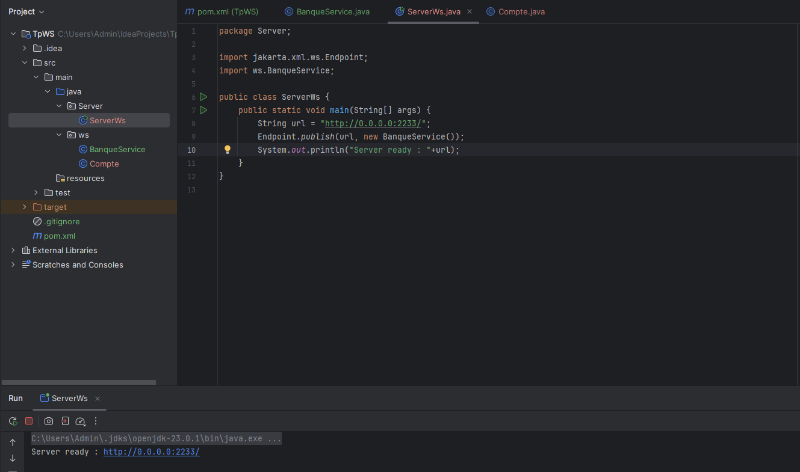
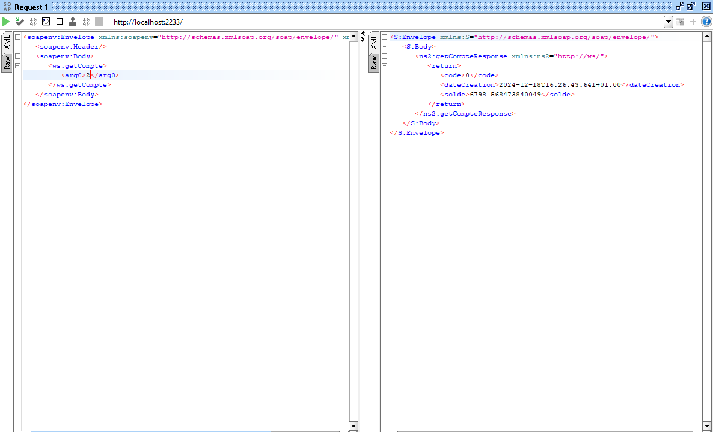
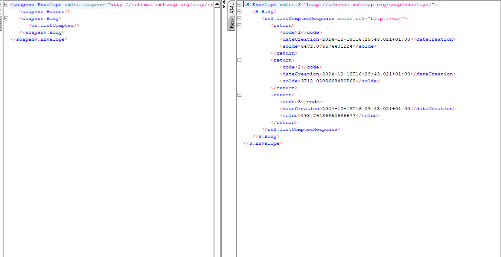
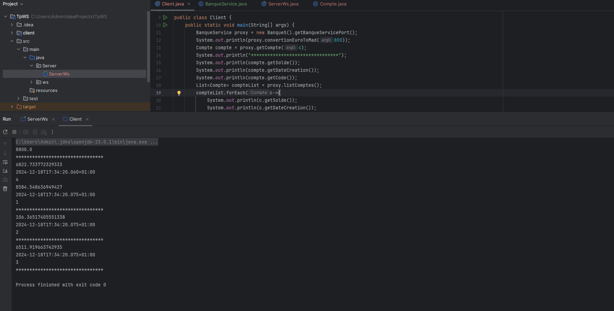

# 🏦 Web Service SOAP Bancaire avec JAX-WS

## 📋 Vue d'ensemble
Service web **SOAP** développé en **Java** utilisant **JAX-WS**, offrant des fonctionnalités bancaires essentielles et une architecture **client-serveur** robuste.

## 🎯 Fonctionnalités principales
- 💱 **Conversion EUR → MAD** (Dirham Marocain)
- 🏦 **Consultation des comptes bancaires**
- 📊 **Liste complète des comptes disponibles**

## 🛠️ Technologies utilisées
- **Java**
- **JAX-WS** (Java API for XML Web Services)
- **SOAP** (Simple Object Access Protocol)
- **WSDL** (Web Services Description Language)
- **SoapUI** (Tests des services SOAP)

## 📸 Captures d'écran et démonstration

### 1. Déploiement du Web Service
 
Publication du service sur le serveur JAX-WS via `Endpoint.publish`.

### 2. Analyse du WSDL
 
Interface WSDL auto-générée définissant les opérations disponibles

### 3. Structure de la Requête SOAP - Conversion

Requête **SOAP** pour la conversion de devise.

### 4. Structure de la Requête SOAP - Détails Compte

Requête **SOAP** pour obtenir les détails d'un compte.

### 5. Structure de la Requête SOAP - Liste Comptes
 
Requête **SOAP** pour récupérer tous les comptes.

### 6. Résultat final
  
Console montrant les résultats des opérations.

## 📥 Installation et Exécution

### Cloner le projet

- git clone https://github.com/Clear008/TpWS.git
- cd TpWS

## ⚙️ Configuration

- Le service est accessible sur : http://0.0.0.0:2233
- WSDL disponible sur : http://0.0.0.0:2233/?wsdl

## 🧪 Tests
Via SoapUI

- Créer un nouveau projet SOAP dans SoapUI
- Importer le WSDL (http://0.0.0.0:2233/?wsdl)
- Tester les opérations disponibles

## 👨‍💻 Auteur

- **Nom**: Wissal Leknouch
- **GitHub**: @Clear008